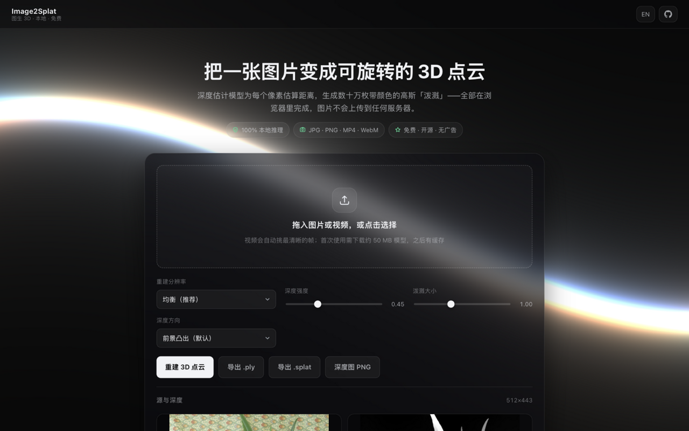

# Image2Splat · 图生 3D 高斯泼溅

> 把一张图片或一段视频，变成可旋转的 3D 高斯泼溅点云——深度估计模型为每个像素估算距离，生成数十万枚带颜色的高斯「泼溅」。**纯静态部署，深度推理与渲染全部在浏览器里完成，文件不上传任何服务器。**

[](https://forjiang.github.io/image-to-splat/)
[](LICENSE)
[](index.html)
[](models/depth-anything-v2-small)

English intro at the bottom → [English](#-english)

---

## ✨ 功能特性

| | |
| --- | --- |
| 🏞️ **图片模式** | 拖入 JPG / PNG / WebP 即可重建，`createImageBitmap` 自动烘焙 EXIF 方向，手机直拍也能用 |
| 🎬 **视频自动选帧** | 均匀抽 16 帧，按拉普拉斯方差自动挑最清晰的一帧参与重建，也可以手动点选换帧；seek 不了的分片视频（如 MediaRecorder 直出）自动降级为播放采样 |
| 🎚️ **实时参数** | 深度强度、泼溅大小、深度方向调整即时生效（约 30ms，无需重新推理）；重建分辨率 流畅 384 / 均衡 512 / 高清 640 三档 |
| 🧊 **高斯点云渲染** | three.js 自定义 Points 着色器：不透明圆盘 + 径向明暗近似高斯体积感，深度写入获得正确遮挡，无需逐帧排序；边缘泼溅自动收缩、位置抖动打散网格感 |
| 📦 **多格式导出** | `.ply`（Blender / CloudCompare / SuperSplat 可开）、`.splat`（antimatter15 / SuperSplat 泼溅格式，按体积降序 + 恒等四元数）、深度图 PNG、当前视角截图 |
| ⚡ **WebGPU 加速** | 有 WebGPU 以 fp16 运行，否则自动回退 int8 量化 + WASM；模型浏览器缓存后二次访问基本秒开 |
| 🌐 **中英双语** | 跟随系统语言，顶栏一键切换，移动端自适应 |
| 🎬 **卡片入场动画** | 主面板、3D 预览、汇总统计随滚动淡入上移；`prefers-reduced-motion` 下自动静止，无 JS 时内容直接可见 |
| 📱 **移动端稳定** | 背景画布尺寸稳定捕获 + 独立合成层，滚动时背景钉住不滑不抖；毛玻璃效果按屏幕宽度降级，保证滚动流畅 |
| 🔒 **隐私优先** | 无任何上传代码，模型加载后断网也能用；无日志、无追踪 |
| 🚀 **真正静态** | 无构建、无依赖安装，GitHub Pages 直接发布；模型与依赖全部自托管，不请求任何第三方域名 |

## 🖼️ 界面预览



深色玻璃面板 + WebGL 正弦波线条背景（原生 WebGL1 复刻 three.js `RawShaderMaterial` 效果，零第三方依赖，`prefers-reduced-motion` 下自动静止、页面隐藏时暂停渲染；移动端滚动时背景稳定，不随地址栏收放重排）。顶栏固定 60px 高，与 [image-metadata-cleaner](https://forjiang.github.io/image-metadata-cleaner/)、[rvc-sound-clone](https://forjiang.github.io/rvc-sound-clone/) 的排版规格一致。

## 🧩 它是怎么工作的

```
浏览器（纯静态站点）
 ├─ 拖入 / 选择 ──► 图片解码（EXIF 方向烘焙）或视频抽帧（清晰度自动选帧）
 ├─ 缩放到 384 / 512 / 640 ──► Depth Anything V2 推理（WebGPU fp16 / WASM q8）
 ├─ predicted_depth 浮点反深度 ──► 2%–98% 分位归一化 ──► Z = (d − 0.5) × 强度
 ├─ 每个像素 ──► 高斯圆盘（原图颜色，尺寸 ∝ 1/(1+2×|∇depth|)，确定性抖动）
 └─ three.js Points 着色器渲染 ──► 导出 .ply / .splat / 深度图 PNG
```

| 模块 | 职责 |
| --- | --- |
| `assets/js/depth.js` | transformers.js 加载自托管模型（禁用远端回退），WebGPU/WASM 双后端自动降级，聚合下载进度 |
| `assets/js/splat.js` | 深度归一化、梯度计算、逐像素生成泼溅（位置 / 颜色 / 尺寸三组属性） |
| `assets/js/viewer.js` | three.js 场景与自定义泼溅着色器，轨道控制、自动环绕、像素级截图 |
| `assets/js/video.js` | 双路径抽帧：按时长 seek（先修分片视频的 `Infinity` 时长），失败降级 `requestVideoFrameCallback` 播放采样 |
| `assets/js/exporter.js` | 二进制 PLY（binary_little_endian）与 32 字节/点 .splat（体积降序）编码 |
| `assets/js/main.js` | 状态机与事件接线：文件入口 → 推理 → 重建 → 交互/导出 |
| `assets/js/wave-bg.js` | 正弦波线条背景（原生 WebGL1，uniforms 与参考组件一致） |
| `assets/js/i18n.js` | 中英双语文案 |
| `assets/js/reveal.js` | 卡片入场动画：滚动揭示（时间戳节流 + 400ms 轮询兜底，不依赖 IntersectionObserver / rAF） |
| `models/` | Depth Anything V2 small 自托管权重：fp16 49.6MB（WebGPU）+ q8 27.3MB（WASM） |

## 🚀 快速开始

**在线使用**：<https://forjiang.github.io/image-to-splat/> —— 打开即用，首次需下载约 50 MB 模型（之后有缓存）。

**本地运行**（任一静态服务器均可）：

```bash
python3 -m http.server 8000
# 打开 http://127.0.0.1:8000
```

**调试模式**：`?mock=1` 用合成深度图代替模型，可离线验证点云 / 导出链路。

## ❓ 常见问题

**能重建出完整的 3D 模型吗？** 不能完全。单张图片只有正面信息，生成的是「正面 + 深度浮雕」（2.5D），被遮挡的背面无法凭空还原；完整的多视角 3D 高斯泼溅需要多角度照片加 GPU 训练（nerfstudio、Postshot 等）。

**我的图片或视频会被上传吗？** 不会。模型加载后，深度推理、点云构建、导出全部在你的浏览器里完成，断网也能用；页面没有任何上传代码。

**首次使用为什么要等一会儿？** 首次需要下载约 50 MB 的深度模型（随站点自托管），之后浏览器会缓存，二次访问基本秒开。

**什么样的素材效果最好？** 主体清晰、有明确前后层次的场景，比如人物、盆栽、建筑立面；视频建议环绕物体拍摄，选物体正对镜头的一帧。

---

## 🇬🇧 English

**Image2Splat** — turn a single photo or a video frame into a rotatable 3D gaussian-splatting point cloud. A depth-estimation model measures the distance of every pixel and raises hundreds of thousands of colored splats. Fully client-side, zero uploads, zero third-party requests.

- **Live**: <https://forjiang.github.io/image-to-splat/>
- **Local**: `python3 -m http.server 8000` → open `index.html`
- **Debug**: `?mock=1` replaces the model with a synthetic depth map (offline pipeline check)
- **Pipeline**: decode → Depth Anything V2 (WebGPU fp16 / WASM q8, self-hosted ONNX) → percentile-normalized depth → one gaussian disc per pixel → custom three.js Points shader → export `.ply` / `.splat`
- **Design**: same dark-glass system as [image-metadata-cleaner](https://forjiang.github.io/image-metadata-cleaner/) — 60px topbar, WebGL sine-wave background, reveal animations, zh/en i18n

## 📄 License

[MIT](LICENSE)
